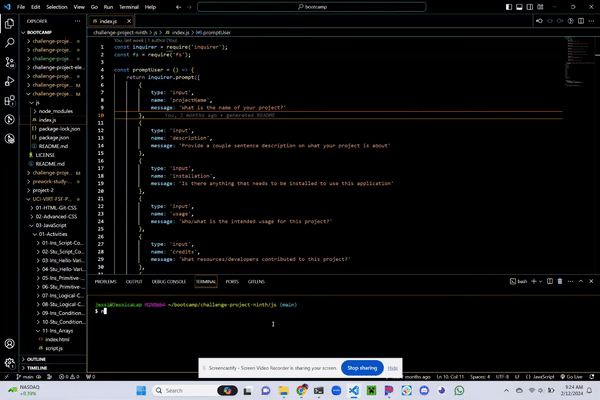
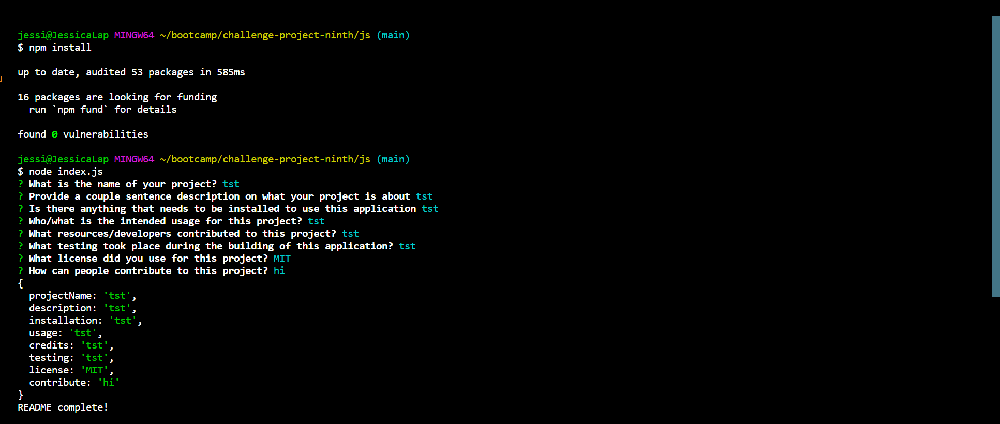

 # Generated README

## Description

This project was to show my knowledge on how to create a README only using backend technologies (i.e. index.js, fs, inquirer, npm). This can be used as a way to streamline writing a README for a project. Using only backend technologies was an interestig challenge.  Inquirer was used to prompt the user to the use of their project and fs was used to generate the text into the template format as well as create the file.

## Installation

Simply type "npm install" in your coding application's integrated terminal and it will install inquirer and fs. If that does not work you can simply type "npm i inquirer" and "npm i fs-extra" into your coding application's integrated terminal.

## Usage

The intended use for this application is to speed up the README.md writing process. No more do you have to type out the annoying titles and subtitles. Simply delete those from your memory!

## Credits

A special thank you to my tutor, Andrew Hardemon, for helping me change around some of the varaibles and figuring out why my application wasn't prompting the user properly when trying to write the document. Other resources were in-class assignments, and both inquirer/fs-extra documentation.

## Testing

The testing that took place during this was simply used in the integrated terminal to run the program and then tweaking the code from there.

## License

MIT

## How to Contribute

If there are any ideas on how to contribute, please create a Github issue.
